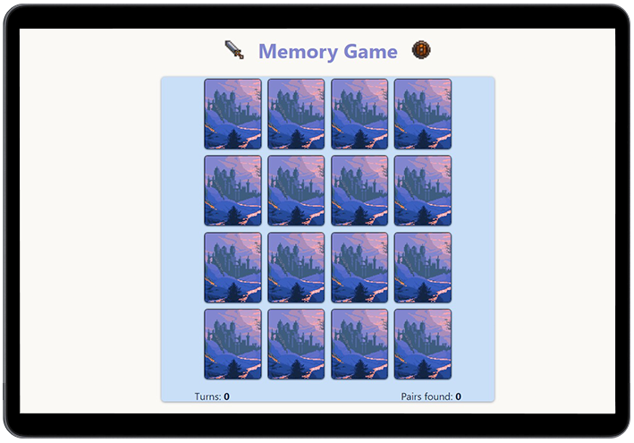

# Memory Game

Play the game [here]()


### Short Description
Test your memory with this memory game.


### Preview





### Built with

### Client - 
- React 18
- TypeScript
- StyledComponent

### Run Locally

To run **Memory Game** locally, run this command on your git bash:

Linux and macOS:

```bash
sudo git clone https://github.com/momo-dev1/Memory-Game
```

Windows:

```bash
git clone https://github.com/momo-dev1/Memory-Game
```

